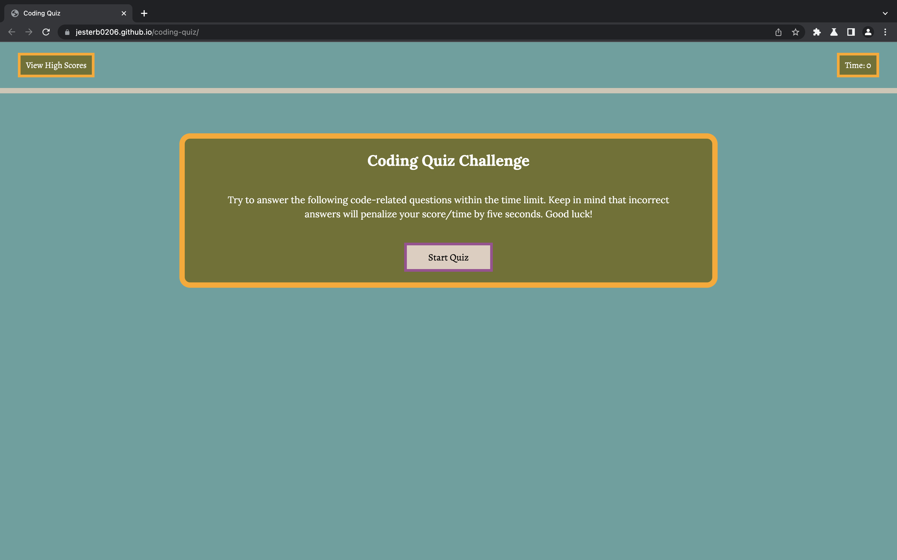

# Coding Quiz Challenge

## Description

A few months down the road, when I'm further along in my journey to becoming a full-stack web developer, and I've completed the University of Washington's Coding Boot Camp, I'll most likely be asked to complete a coding assessment as part of an interview process. In order to begin preparing myself for my future technical interviews, I decided to build a coding quiz using an application programming interface (API) called the Document Object Model (DOM). I also decided to build this project because it helped me get my feet wet and begin learnings about APIs, which are an essential part of every developer's toolkit. This project helps other current coding boot camp students and myself, as well as Computer Science majors, those who are self-teaching, etc. gauge their progress when it comes to understanding JavaScript fundamentals. They're able to complete the coding quiz and identify areas that they need to work on in order to become a full-stack web developer. Through completing this project I was able to begin learning about how to generate HTML elements using Web API methods, how to implement DOM API methods to handle events like key presses and mouse clicks, and how to store and retrieve data using the browser's local storage.

A timed coding quiz with multiple-choice questions to help you prepare for the technical interview process.

## Usage

A few things to note:

- When you click, "Start Quiz," a timer will begin counting down from 60 seconds and you'll be presented with a question. For each question, you'll have 4 options to choose from. If you select the right answer, the word "correct" will appear at the bottom of the screen. If you select the wrong answer, the word "incorrect" will appear at the bottom of the screen and 5 seconds will be subtracted from the total alloted time. If you complete all the questions before the timer reaches 0, or if the timer reaches 0 before you've answered every question, then the game is over.
- When the game is over a new screen will appear, telling you that the game is, "All Done," and your final score. If you press, "submit," before entering your initials in the form, an error message will appear saying, "Enter your initials in 3 or less characters!" If you try to view your high scores before submitting your initials, another error message will appear saying, "Please enter your initials first!" Finally, if you try to view your high scores while the quiz is currently still going, a final error message will appear saying, "You can't view your high scores until the quiz has been completed!"
- Once you've submitted your initials your high scores will appear alongside your initials. You have the option to clear your high scores by clicking the "Clear High Scores" button, or to go back to the start page by clicking the "Go Back" button. Clicking the "Go Back" button allows you to take the quiz again if you heart so desires!

https://jesterb0206.github.io/coding-quiz/

## Credits

For my Coding Quiz Challenge, I drew design inspiration/ideas from the following sources:

https://www.figma.com/google-fonts/lora-font-pairings/ - Figma [I used their Lora/Alegreya font pairing for my web application]

https://fonts.google.com - Google Fonts 

http://khroma.co - Khroma [I used their Bone, Breaker Bay, Pesto, Soft Amber, Tapestry, and Web Orange colors for my web application]

## License

Please refer to the LICENSE in the repo.
